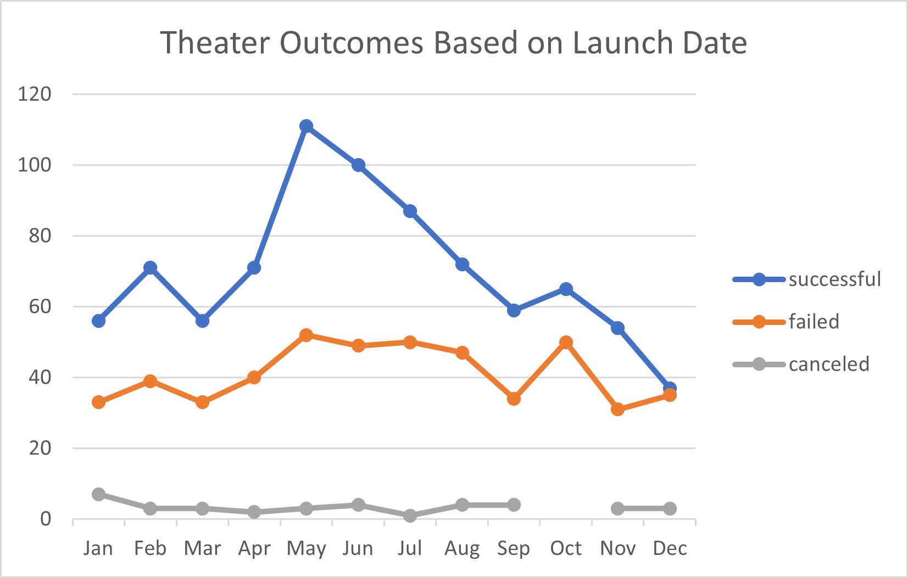
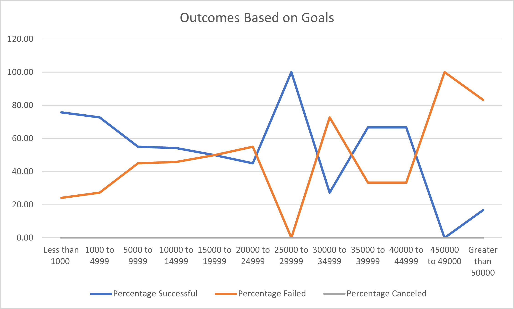

# Kickstarting with Excel

## Overview of Project

Louise Play "Fever" came close to funding goal and she wants data to know how different campaigns fared in relation with launch date and funding goals

### Purpose

Is to provide data based on their launch dates and funding goals

## Analysis and Challenges
Step 1: Understand data

Step 2: Ask Question- Who, What, Where, When, Why, How

Step 3: Format data - Example: Date to Years, Spearting Category | Parent and Sub 

Step 4: clean data- Look for outliers or any blanks, or number errirs in average function

Step 5: Organize data- Filters Applied, Conditional formatting  and Functions.

Step 6: STD and Variance calsulations

1. Anaylize data on requirements of Launch date Using Pivot charts

2. Creating Line graph

3. Use countifs() function for detail analysis by Successful, Failed and Canceled campaigns.

4. Create outcome based on goals

5. Create line graph for visulaization

### Analysis of Outcomes Based on Launch Date

1. A "Years" column is created based on the "Date Created Conversion" column in the Kickstarter spreadsheet 

2. A pivot table is created in a new worksheet labeled "Theater Outcomes by Launch Date"

3. The pivot table filters on "Parent Category" and "Years"

4. Clumns, rows, and values in the pivot table fields are correctly populated

5. "Parent Category" is filtered on "theater" 

6. Row labels are changed to display the months of the year, and the campaign outcomes are sorted in descending order

7. A line chart is created showing the number of successful, failed, or canceled projects by month, it has a title, and it is saved as Theater_Outcomes_vs_Launch.png

### Analysis of Outcomes Based on Goals

1. New Sheet added as "Outcomes Based on Goals."

2. Neeed colums created to find results

3. Data filtered vis Countifs() function

4. Line chart created showing Outcome based on Goals  via worksheet and line chart

### Challenges and Difficulties Encountered

 1. Using countifs() function as individuals celss need modification for each columnsd and rows

## Results

- What are two conclusions you can draw about the Outcomes based on Launch Date?

1. Month of May is best Month for launch

2. Month of October was worst in failing performances

- What can you conclude about the Outcomes based on Goals?

1. Goal range $1000 to $4999 has highest numbers for successful plays

2. percentage wise less than $1000 is highest

- What are some limitations of this dataset?

1. Some factors are keping people from pledging to those failed projects

2. too many results are close for successful and failed project with similar pledge amount.

- What are some other possible tables and/or graphs that we could create?

1. We can creat bar graphs, Stacked colum graphs.
